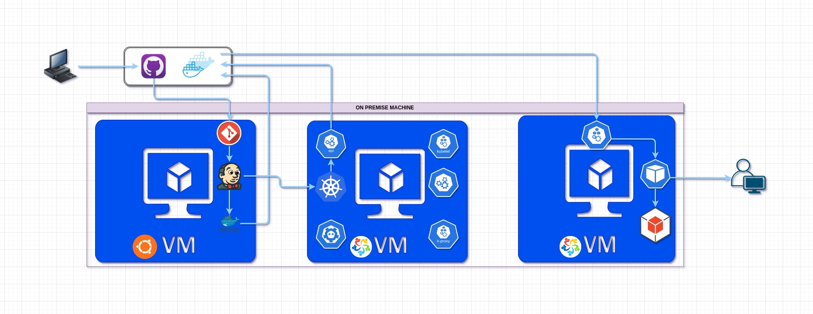

# Sample FastAPI App

This is a sample FastAPI application to demonstrate CI/CD with Jenkins, Docker, and Kubernetes.

## Table of Contents

- [Prerequisites](#prerequisites)
- [Infrastructure provisioning](#infrastructure_provisioning)
- [Pipeline](#pipeline)

## Prerequisites

To run this application, you need to have the following software installed:

- Linux distribution
- Python 3.9 or higher
- Jenkins
- Docker
- Kubernetes (for deployment)

## Infrastructure provisioning

Assuming we are working on a Linux-based distribution, we'll need VMbox and Vagrant installed which will be needed for Kubernetes cluster setup.

For this project, we'll be using three VM. One ubuntu based, other two will be Alma Linux based. 

In our Ubuntu-based VM, we will set up Jenkins and Docker.

In our Alma-based VM, we will set up one Kubernetes cluster and one worker.

Here are the provisioning scripts https://drive.google.com/drive/folders/1CluibA2_btDltn2EEkqWp7LaYM6j_qP7?usp=drive_link

Run the ubuntu_conf.sh to set up Jenkins and Docker.

Run the Vagrantfile from the alma-cluster and alma-worker directory to provision the Kubernetes cluster and worker. 
After accessing Kubernetes worker, run the kubeadm join command saved inside join.sh file. Or copy it from the terminal of Kubernetes-cluster.

## Pipeline

Install necessary plugins in Jenkins for Docker and Kubernetes.  
Create credentials for github, docker-hub and kubernetes, ID as Git-Hub-Auth, Docker-Hub-Auth, and Kube-Config respectively. Or change the name in pipeline accordingly.  
Create a pipeline and run it, ensuring Kubernetes VMs are running.  
When the build is complete, site can be access from browser at 'http://192.168.56.20:30080'
